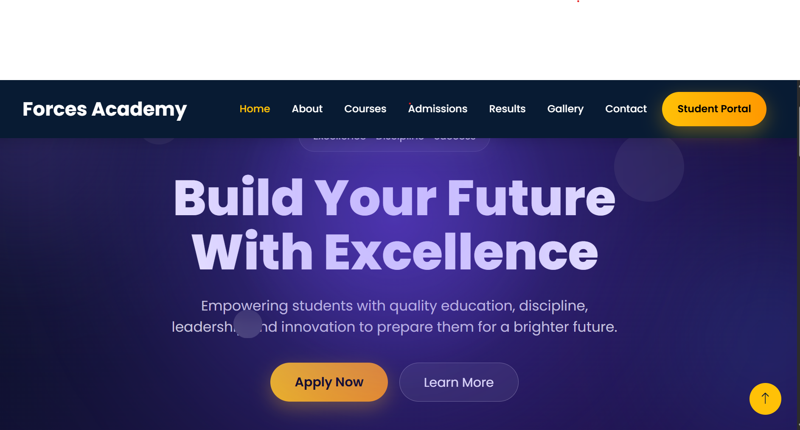
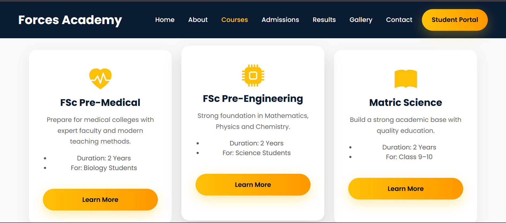
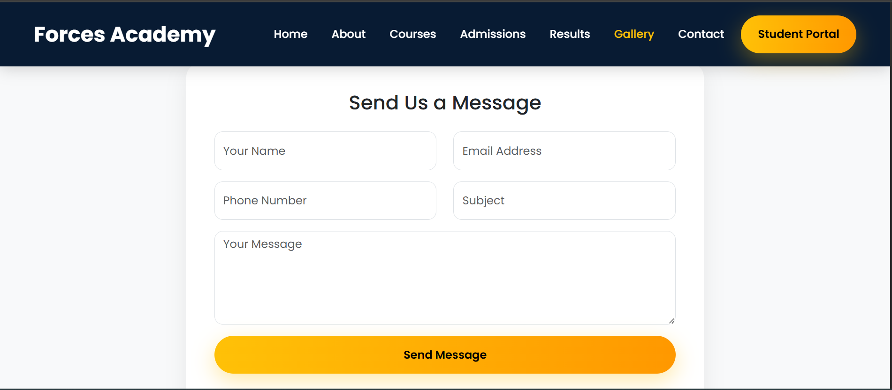

# 🎓 Forces Academy Faisalabad Website

A modern, responsive, and interactive educational website developed as part of the **Frontend Internship Program — Code Saviours SI-26 (2026)**.

The website provides information about Forces Academy Faisalabad, including courses, admissions, academic results, gallery, testimonials, and contact information.

---

## 🌐 Live Website

https://fidafiza.github.io/forces-academy/

## 📂 GitHub Repository

https://github.com/fidafiza/forces-academy

---

## ✨ Features

- Responsive and modern educational website
- Responsive navigation bar
- Premium hero sections
- Animated statistics counter
- Testimonials carousel
- Smooth scrolling
- Back to Top button
- About Academy section
- Courses section with responsive cards
- Admissions information
- Academic Results table
- Gallery with category filtering
- GLightbox image preview
- Contact form with JavaScript validation
- Google Maps integration
- Social media links
- Responsive design for mobile, tablet, and desktop
- Consistent navbar and footer across pages
- Button and link hover effects
- Distinct Student Portal button
- Cross-browser tested

---

# 📅 Weekly Progress

## ✅ Week 1 — Home Page

### Completed
- Responsive Home Page
- Premium Hero Section
- Responsive Navigation Bar
- Modern Footer
- Bootstrap Integration
- Custom CSS Styling
- GitHub Pages Deployment

---

## ✅ Week 2 — About, Courses & Admissions

### About Page
- Academy Overview
- Mission & Vision
- Why Choose Us
- Leadership Team

### Courses Page
- Course Introduction
- 6 Responsive Course Cards
- Bootstrap Card Layout
- Learn More Buttons

### Admissions Page
- How to Apply
- Eligibility Criteria
- Required Documents
- Fee Structure
- Apply Now CTA

---

## ✅ Week 3 — Results, Gallery & Contact

### Results Page
- Responsive Results Table
- Class and Year Filter UI
- Sample student results
- Administration note

### Gallery Page
- Responsive Gallery Grid
- GLightbox Image Preview
- Gallery Category Filter using JavaScript
- Categories:
  - All
  - Events
  - Sports
  - Academic

### Contact Page
- Contact Form
- JavaScript Form Validation
- Google Maps Embed
- Contact Information Cards
- Social Media Section

---

## ✅ Week 4 — JavaScript Interactivity + Animations

### Animated Stats Counter
Added animated statistics for:
- Number of Students
- Years of Excellence
- Courses Offered
- Success Rate

Used JavaScript and the **Intersection Observer API** to trigger the counters when the section enters the viewport.

### Testimonials Slider
- Added testimonial cards
- Student photo placeholders
- Student names and class/year
- Testimonial quotes
- Automatic slideshow
- Manual previous/next controls
- Bootstrap Carousel

### Smooth Scroll + Back to Top
- Added smooth scrolling behavior
- Added floating Back to Top button
- Button appears after scrolling down
- Smoothly returns to the top of the page

### Responsive & Cross-Page Polish
Reviewed:
- Home
- About
- Courses
- Admissions
- Results
- Gallery
- Contact

Checked:
- Consistent navbar
- Active navigation links
- Consistent footer
- Responsive layout
- 375px mobile
- 768px tablet
- 1440px desktop
- Working links
- Working images
- Hero section alignment
- Mobile/tablet spacing

---

# ✅ Week 5 — Final Polish + Deployment + Testing

## Final Visual Polish

- Reviewed all website pages for consistency
- Improved hero section decorative bubble positioning
- Checked typography and readability
- Reviewed spacing across sections
- Maintained consistent color scheme
- Verified button hover effects
- Verified link hover effects
- Made Student Portal visually distinct
- Improved responsive appearance

## Cross-Browser Testing

The website was tested on:

- ✅ Google Chrome
- ✅ Microsoft Edge
- ✅ Mozilla Firefox

### Mobile Testing

Responsive layouts were tested using Chrome DevTools at:

- ✅ 375px Mobile
- ✅ 768px Tablet
- ✅ 1440px Desktop

### Final Checks

- ✅ Navigation links working
- ✅ Images loading correctly
- ✅ Navbar consistent across pages
- ✅ Footer consistent across pages
- ✅ Responsive layouts
- ✅ Buttons working
- ✅ Hover effects
- ✅ Back to Top button
- ✅ Gallery filtering
- ✅ Contact form validation
- ✅ Testimonials carousel
- ✅ Animated statistics counter

---

# 🛠️ Tech Stack

- HTML5
- CSS3
- Bootstrap 5
- JavaScript
- Bootstrap Icons
- Google Fonts — Poppins
- GLightbox
- Intersection Observer API
- Bootstrap Carousel
- Google Maps
- Git
- GitHub
- GitHub Pages

---

# 📄 Website Pages

1. Home
2. About
3. Courses
4. Admissions
5. Results
6. Gallery
7. Contact

---

# 📸 Screenshots

### 🏠 Home Page

### 📚 Courses Page

### 📞 Contact Page

# 🎯 Final Project Outcome

The Forces Academy Faisalabad website was developed into a complete responsive educational website with modern UI design, JavaScript interactivity, animations, responsive layouts, cross-page consistency, and GitHub Pages deployment.

The website was tested across desktop browsers and responsive screen sizes to ensure a consistent user experience.

---

## 🚀 Deployment

The project is deployed using **GitHub Pages**.

### Live Site

https://fidafiza.github.io/forces-academy/

---

## ⚠️ Known Issues / Future Improvements

- Add a backend/database for real student results.
- Connect the admission form to a backend system.
- Add a real student portal authentication system.
- Add an admin dashboard for managing results and content.
- Optimize and compress images further for improved loading speed.
- Add more dynamic content and real academy data in the future.

## 📌 Project Status

**Week 5 — ✅ Completed**

**Final Polish + Deployment + Testing — ✅ Completed**

# Forces Academy Faisalabad — Week 6

## Advanced Features

Week 6 focuses on adding advanced frontend features that improve the user experience and make the Forces Academy Faisalabad website more professional.

### 🚀 Features Completed

#### 1. Dark Mode Toggle
- Added Dark/Light Mode toggle button in the navbar.
- Added JavaScript functionality to switch between light and dark themes.
- Dark mode styles are defined using `body.dark-mode`.
- User theme preference is saved using `localStorage`.
- Theme preference remains active while navigating between pages.
- Moon icon appears in light mode.
- Sun icon appears in dark mode.

#### 2. Page Load Animations
Added subtle and professional CSS animations to the Home page.

- Hero heading fades in when the page loads.
- Statistics cards slide up when they come into view.
- Course cards appear one by one with staggered delays.
- CSS `@keyframes` and animation properties are used.
- Animations are kept smooth and professional.

#### 3. SEO Basics
Added basic SEO optimization to all website pages.

- Meta description
- Meta keywords
- Open Graph title
- Open Graph description

These tags help improve search engine visibility and social media sharing.

#### 4. Favicon
- Added a custom Forces Academy favicon.
- Favicon is displayed in the browser tab.
- Added favicon to all website pages.

#### 5. Image Accessibility
- Added descriptive `alt` attributes to website images.
- Helps improve accessibility and provides alternative text for images.

---

## 📚 Website Pages

The website includes:

- Home
- About
- Courses
- Admissions
- Results
- Gallery
- Contact

---

## 🛠️ Technologies Used

- HTML5
- CSS3
- JavaScript
- Bootstrap 5
- Bootstrap Icons
- Google Fonts

---

## 🌙 Dark Mode

The website supports a complete dark mode experience across all pages.

The selected theme is stored in `localStorage`, so the user's preference remains active while navigating through the website.

---

## ✨ Week 6 Learning Outcomes

Through Week 6, the project was enhanced with:

- Dark mode functionality
- Persistent theme preferences
- CSS animations
- Page load effects
- Staggered card animations
- SEO meta tags
- Open Graph metadata
- Custom favicon
- Image accessibility improvements

---

## 👩‍💻 Project

**Forces Academy Faisalabad**

A modern educational website focused on academic excellence, discipline, leadership, and student development.

---

## 📌 Internship Task

**Week 6 — Advanced Features**

**Frontend Track:** Dark Mode Toggle + Page Animations + SEO Basics

# Week 7 — Final Features + Integration

**Duration:** August 10 – August 14, 2026

## 🎯 Week 7 Overview

Week 7 focused on adding the final frontend features and connecting the Forces Academy Faisalabad website with the Full Stack LMS and EmailJS.

---

## 🚀 Features Completed

### 1. Student Portal LMS Integration

The Student Portal button has been connected to the live Full Stack LMS.

**Live LMS:**  
https://ramish.great-site.net/login.php

The LMS link was updated across all website pages.

---

### 2. Admission Enquiry Form with EmailJS

The enquiry form has been integrated with **EmailJS** to send admission enquiries directly to Gmail.

The form includes:

- Name
- Email Address
- Phone Number
- Course
- Subject
- Message

The submitted information is sent through EmailJS and received in the configured Gmail account.

Latest Announcements / News Section

A Latest Announcements section was added to the Home page to keep students and visitors updated about important academy activities and news.

The section contains three announcement cards, each with a date, title, short description, and a Read More link.

📢 Admissions Open 2026

Date: August 10, 2026

Admissions are now open for the 2026 academic session. Students can explore the available programs and apply for admission at Forces Academy Faisalabad.

Read More: Admissions Page

🏆 Result Announcement

Date: August 7, 2026

The latest academic results have been announced. Students can visit the Results page to check result information and celebrate their academic achievements.

Read More: Results Page

🎓 New Batch Starting

Date: August 5, 2026

A new academic batch is starting soon at Forces Academy Faisalabad. Students can explore the available courses and prepare to begin their academic journey.

Read More: Courses Page

Thank you.

# Week 8 – Final Polish, Documentation & Demo Preparation

## 📅 Week
**Week 8 | August 17 – August 21, 2026**

## 🎯 Objective

The main objective of Week 8 was to complete the final polishing of the Forces Academy Faisalabad website, finalize project documentation, update LinkedIn, and prepare the project for Demo Day.

## ✅ Work Completed

### 1. Final Bug Fix & Polish

- Reviewed the complete website for remaining issues.
- Fixed visual inconsistencies across the website.
- Tested all navigation links and buttons.
- Tested the Contact/Admission Enquiry form.
- Verified EmailJS integration and Gmail email delivery.
- Checked Dark/Light mode functionality.
- Tested the website on different screen sizes.
- Verified the Latest Announcements section.
- Checked the Student Portal/LMS integration.

### 2. GitHub README

- Updated the GitHub README with complete project information.
- Added project description and features.
- Added technologies used in the project.
- Added live website and repository links.
- Added project screenshots.
- Added instructions for running the project locally.
- Documented the final Week 8 work.

### 3. LinkedIn Update

- Added my Web Development Internship at Code Saviours to LinkedIn Experience.
- Added the Forces Academy Faisalabad project to the LinkedIn Featured section.
- Added the live website link.
- Published a LinkedIn post about the completed project and internship experience.

### 4. Demo Day Preparation

Prepared a short project walkthrough for Demo Day, including:

- Home page
- Courses page
- Admissions page
- Contact/Enquiry form
- Latest Announcements
- Dark/Light mode
- Responsive design
- Student Portal/LMS

The project walkthrough was planned to be completed within approximately **5 minutes**.

## 🛠️ Technologies Used

- HTML5
- CSS3
- Bootstrap 5
- JavaScript
- EmailJS
- Git
- GitHub
- GitHub Pages

## 🎓 Built By

**Fiza Fida | Code Saviours SI-26 | 2026**

## 📌 Week 8 Outcome

The Forces Academy Faisalabad website was finalized, tested, documented, published on GitHub Pages, and prepared for the final Demo Day presention . 
